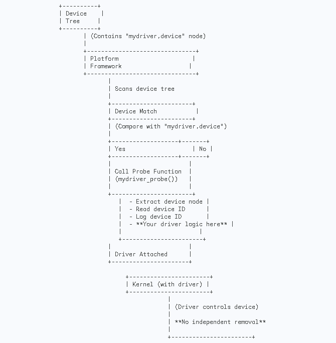

.. SPDX-License-Identifier: GPL-2.0
.. _mydriver:

===========================
Hello World Device tree
===========================
Introduction
------------

The "mydriver" Linux kernel module is a simple example that demonstrates the integration of a platform driver with a Device Tree overlay. The module reads a device ID from the Device Tree during initialization and performs some basic operations in the probe function. Additionally, a Device Tree overlay is provided to configure the device in the Device Tree.
  
Driver Code
-----------

The following is the C code for the "mydriver" Linux kernel module:

.. code:: c

    #include <linux/module.h>
    #include <linux/kernel.h>
    #include <linux/platform_device.h>
    #include <linux/of.h>

    static int mydriver_probe(struct platform_device *pdev)
    {
        struct device_node *np = pdev->dev.of_node;
        int device_id;

        if (!np) {
            pr_err("Device tree node not found\\n");
            return -ENODEV;
        }

        // Read the device ID property
        if (of_property_read_u32(np, "mydriver,device-id", &device_id)) {
            pr_err("Failed to read device ID from device tree\\n");
            return -EINVAL;
        }

        pr_info("Device ID from device tree: %d\\n", device_id);

        // Your driver logic goes here

        return 0;
    }

    static int mydriver_remove(struct platform_device *pdev)
    {
        // Your removal logic goes here
        return 0;
    }

    static const struct of_device_id mydriver_of_match[] = {
        { .compatible = "mydriver,device", },
        {},
    };
    MODULE_DEVICE_TABLE(of, mydriver_of_match);

    static struct platform_driver mydriver_driver = {
        .driver = {
            .name = "mydriver",
            .owner = THIS_MODULE,
            .of_match_table = mydriver_of_match,
        },
        .probe = mydriver_probe,
        .remove = mydriver_remove,
    };

    module_platform_driver(mydriver_driver);

    MODULE_LICENSE("GPL");
    MODULE_AUTHOR("Abhi");

Explanation
------------

1. **Include Headers:**
   - Include necessary Linux kernel headers for modules, kernel, platform devices, and device tree handling.

2. **Probe Function (`mydriver_probe`):**
   - The `mydriver_probe` function is the probe function called when a device with a matching compatible string is found.
   - It retrieves the device tree node associated with the platform device.
   - Checks if the device tree node exists; if not, it prints an error message and returns an error code.
   - Reads the "mydriver,device-id" property from the device tree node and stores it in the `device_id` variable.
   - If reading fails, it prints an error message and returns an error code.
   - Prints the device ID to the kernel log.
   - You can add your specific driver logic in the designated section.

3. **Remove Function (`mydriver_remove`):**
   - The `mydriver_remove` function is called when the driver is being removed.
   - You can implement any cleanup logic specific to your driver in this function.

4. **Device Table (`mydriver_of_match`):**
   - Defines a device table entry with the compatible string "mydriver,device."

5. **Platform Driver Structure (`mydriver_driver`):**
   - Defines the platform driver structure, specifying the driver name, owner, and the device table for matching.
   - Associates the probe and remove functions.

6. **Module Initialization (`module_platform_driver`):**
   - Initializes the module and registers the platform driver.

7. **Module License:**
   - Specifies the GPL license for the module.

Device Tree Overlay
-------------------

The following is the Device Tree overlay for the "mydriver" module:

.. code:: dts

    / {
        mydriver_node {
            compatible = "mydriver,device";
            mydriver,device-id = <123>; 
        };
    };

Explanation
------------

1. **Device Tree Overlay:**
   - Defines a device tree overlay specifying a device node named `mydriver_node`.
   - Specifies the compatible string as "mydriver,device," indicating compatibility with the driver.
   - Sets the "mydriver,device-id" property to a specific value (123 in this example). Replace this with your actual device ID.

2. **Device Node (`mydriver_node`):**
   - Represents the device node in the device tree overlay.
   - Specifies the compatible string to match with the driver.

3. **Device ID Property (`mydriver,device-id`):**
   - Sets a specific device ID for the driver to read during initialization.
   - The value (123) is just an example; replace it with the actual device ID you want to use.

Device Tree Directory Listing
------------------------------

To explore the contents of the Device Tree in the sysfs file system, you can use the following command:

.. code-block:: bash

    ls /sys/firmware/devicetree/base
    #address-cells    cpus              model             pmu@4b000000
    #size-cells       fixedregulator0   mydriver_node     serial-number
    aliases           interrupt-parent  name              soc
    chosen            leds              ocp
    compatible        memory@80000000   opp-table

This command lists the available nodes and properties in the device tree. Each node is represented as a directory, and properties are represented as files within those directories.

Platform Driver Probing Process
------------------------------

The platform driver probing process involves the interaction between the Device Tree, the Platform Framework, and the Kernel. Here's a detailed breakdown:

1. **Device Tree:**
   Contains the device tree specification with a node named "mydriver,device" representing the platform device.

2. **Platform Framework:**
   The platform framework in the kernel scans the device tree for platform devices.

3. **Device Match:**
   The platform framework matches the device in the device tree based on compatibility strings, identifying the "mydriver,device" node.

4. **Probe Function Call:**
   If there is a match, the kernel calls the probe function (`mydriver_probe()`) associated with the platform driver.

5. **Probe Function Execution:**
   - The `mydriver_probe()` function performs tasks like extracting device information, reading device ID from the device tree, logging device ID, and executing your driver-specific logic.

6. **Driver Attached:**
   The driver is successfully attached to the platform device, gaining control over the device.

7. **Kernel (with Driver):**
   The kernel, with the attached driver, controls the platform device.

8. **No Independent Removal:**
   In this simplified scenario, the removal logic is not explicitly shown, and there's no independent removal step. The driver remains attached as long as the kernel is running.

.. SPDX-License-Identifier: GPL-2.0
.. kernel-doc:: drivers/platform/mydriver.c
    :export:
    :doc:

.. _mydriver_driver:

.. SPDX-License-Identifier: GPL-2.0
.. kernel-doc:: drivers/platform/mydriver.c
    :export:
    :doc:

.. _mydriver_driver:

My Driver
=========

Overview
--------

The `mydriver` module serves as a platform driver for a custom device in the Linux kernel. It interacts with the device tree to extract necessary information about the hardware.

Module Code
-----------

The module code consists of a structure to hold driver-specific data and functions to handle device probing and removal.

1. **`struct mydriver_data`**: This structure defines the driver-specific data, including the device ID, device name, base address, size, interrupt number, and compatible string.

2. **`mydriver_probe` function**: This function is called when the associated device is detected. It extracts information from the device tree using Open Firmware (OF) functions. Key steps include:

   - Obtaining the device node using `pdev->dev.of_node`.
   - Allocating memory for driver-specific data using `devm_kzalloc`.
   - Reading various properties from the device tree using `of_property_read_*` functions.
   - Printing the extracted information using `pr_info`.
   - Setting the driver-specific data using `platform_set_drvdata`.

3. **`mydriver_remove` function**: This function is called when the device is being removed. You would typically place cleanup logic here.

4. **`mydriver_of_match` array**: This array is used to match the device tree node with the compatible string specified in the driver. In this case, it matches with `"mydriver,device"`.

5. **`mydriver_driver` structure**: This structure defines the platform driver, specifying the name, owner, and callback functions for probing and removal.

6. **Module Information**: Licensing information, authorship, and other module-level details.

.. code:: c

    #include <linux/module.h>
    #include <linux/kernel.h>
    #include <linux/platform_device.h>
    #include <linux/of.h>

    struct mydriver_data {
        int device_id;
        const char *device_name;
        resource_size_t reg_base;
        resource_size_t reg_size;
        int interrupt_number;
        const char *compatible;
    };

    static int mydriver_probe(struct platform_device *pdev)
    {
        struct device_node *np = pdev->dev.of_node;
        struct mydriver_data *data;
        int ret;

        if (!np) {
            pr_err("Device tree node not found\\n");
            return -ENODEV;
        }

        // Allocate memory for driver-specific data
        data = devm_kzalloc(&pdev->dev, sizeof(*data), GFP_KERNEL);
        if (!data)
            return -ENOMEM;

        // Read the device ID property
        if (of_property_read_u32(np, "mydriver,device-id", &data->device_id)) {
            pr_err("Failed to read device ID from device tree\\n");
            return -EINVAL;
        }

        // Read the device name property
        ret = of_property_read_string(np, "mydriver,device-name", &data->device_name);
        if (ret) {
            pr_err("Failed to read device name from device tree\\n");
            return ret;
        }

        // Read the reg property (base address and size)
        ret = of_address_to_resource(np, 0, &data->reg_base, &data->reg_size);
        if (ret) {
            pr_err("Failed to read 'reg' property from device tree\\n");
            return ret;
        }

        // Read the interrupt property
        if (of_property_read_u32(np, "interrupts", &data->interrupt_number)) {
            pr_err("Failed to read 'interrupts' property from device tree\\n");
            return -EINVAL;
        }

        // Read the compatible property
        ret = of_property_read_string(np, "compatible", &data->compatible);
        if (ret) {
            pr_err("Failed to read 'compatible' property from device tree\\n");
            return ret;
        }

        pr_info("Device ID from device tree: %d\\n", data->device_id);
        pr_info("Device name from device tree: %s\\n", data->device_name);
        pr_info("Base address: 0x%llx, Size: 0x%llx\\n", (unsigned long long)data->reg_base, (unsigned long long)data->reg_size);
        pr_info("Interrupt number: %d\\n", data->interrupt_number);
        pr_info("Compatible string: %s\\n", data->compatible);

        // Your driver logic goes here

        // Store the driver-specific data in the platform device
        platform_set_drvdata(pdev, data);

        return 0;
    }

    static int mydriver_remove(struct platform_device *pdev)
    {
        // Your removal logic goes here
        return 0;
    }

    static const struct of_device_id mydriver_of_match[] = {
        { .compatible = "mydriver,device", },
        {},
    };
    MODULE_DEVICE_TABLE(of, mydriver_of_match);

    static struct platform_driver mydriver_driver = {
        .driver = {
            .name = "mydriver",
            .owner = THIS_MODULE,
            .of_match_table = mydriver_of_match,
        },
        .probe = mydriver_probe,
        .remove = mydriver_remove,
    };

    module_platform_driver(mydriver_driver);

    MODULE_LICENSE("GPL");
    MODULE_AUTHOR("Abhi");

Device Tree Snippet
-------------------

The device tree snippet provides information about the hardware connected to the `mydriver` module.

1. **Device Node Definition**: The device node named `mydriver_node` specifies properties such as compatibility, device ID, device name, register information (base address and size), interrupt number, and device status.

   - `compatible`: Matches with the driver's compatible string.
   - `mydriver,device-id`: Specifies the device ID.
   - `mydriver,device-name`: Specifies the device name.
   - `reg`: Specifies the base address (0x10000000) and size (0x1000) of the device registers.
   - `interrupts`: Specifies the interrupt number (42).
   - `status`: Specifies that the device is in an "okay" state (enabled).

.. code:: dts

    /dts-v1/;
    /plugin/;

    / {
        compatible = "myboard";

        mydriver_node {
            compatible = "mydriver,example-device";
            mydriver,device-id = <123>;
            mydriver,device-name = "example_device";
            reg = <0x10000000 0x1000>;  // base address: 0x10000000, size: 0x1000
            interrupts = <42>;         // interrupt number
            status = "okay";            // device is enabled
        };
    };

